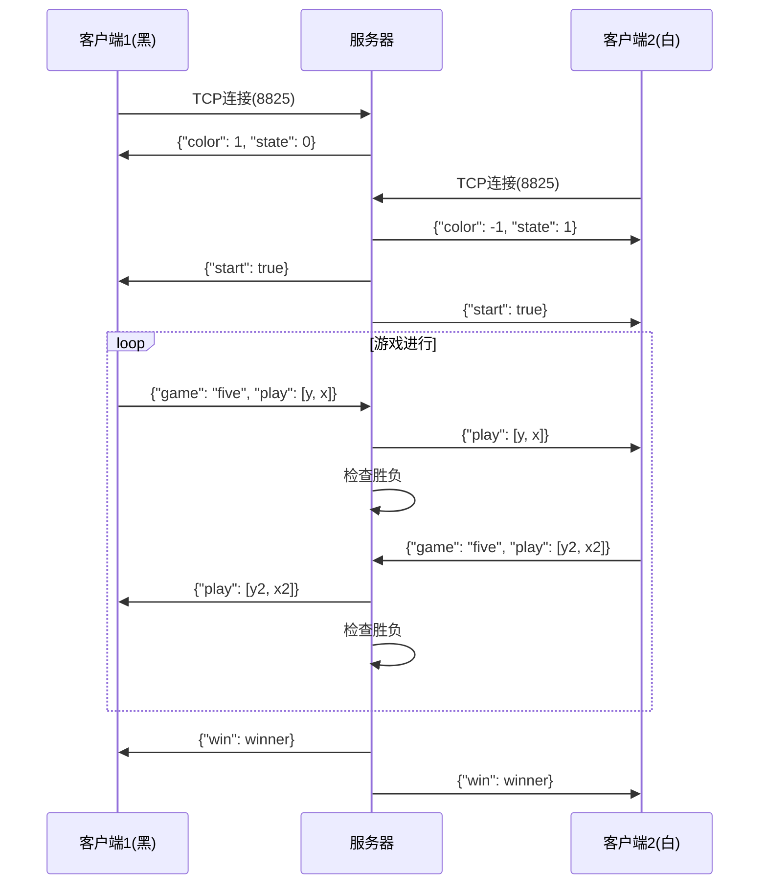
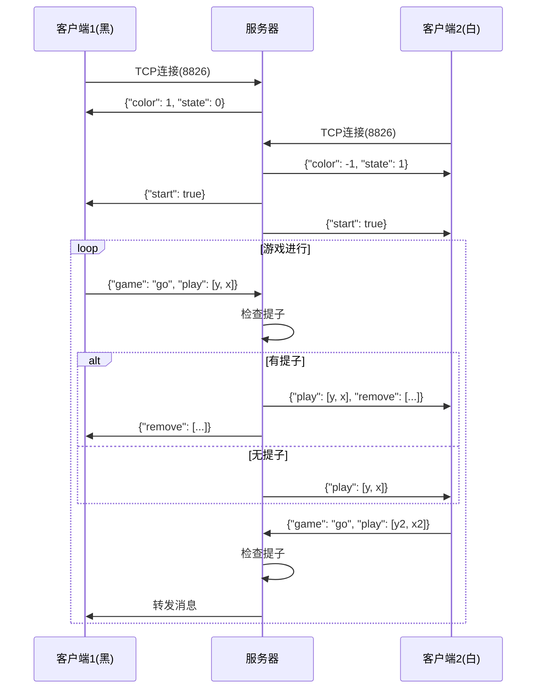

# GoAndFive 网络协议文档

## 概述

GoAndFive 使用基于 TCP 的 JSON 消息协议进行客户端与服务器之间的通信。本文档详细描述了所有消息类型、格式和通信流程。

## 网络架构

```
┌─────────────┐        TCP/IP         ┌─────────────┐
│  客户端 1   │ <------ 8825 -------> │             │
├─────────────┤       (Five)          │             │
│  客户端 2   │ <------ 8825 -------> │   服务器    │
├─────────────┤                       │             │
│  客户端 3   │ <------ 8826 -------> │             │
├─────────────┤        (Go)           │             │
│  客户端 4   │ <------ 8826 -------> │             │
└─────────────┘                       └─────────────┘
```

## 端口分配

| 游戏类型 | 端口号 | 协议 | 最大连接数 |
|---------|--------|------|-----------|
| 五子棋   | 8825   | TCP  | 2         |
| 围棋     | 8826   | TCP  | 2         |

## 消息格式

所有消息使用 JSON 格式，采用 `QJsonDocument::Compact` 模式传输。

### 基础消息结构

```json
{
    "game": "string",     // 游戏类型标识
    "type": "string",     // 消息类型（可选）
    "data": {}           // 消息数据（可选）
}
```

## 消息类型详解

### 1. 连接与初始化

#### 1.1 客户端连接请求

客户端连接到服务器时自动建立 TCP 连接，无需发送额外消息。

#### 1.2 服务器响应 - 颜色分配

**方向**: Server → Client  
**触发时机**: 客户端成功连接后

```json
{
    "game": "five",      // "five" 或 "go"
    "color": 1,          // 1: 黑棋, -1: 白棋
    "state": 0           // 0: 第一个玩家, 1: 第二个玩家
}
```

**示例代码**:
```cpp
// 服务器端发送
QJsonObject json;
json.insert("game", QString("five"));
json.insert("color", userFive[fiveUserCount]->color);
json.insert("state", fiveUserCount);

QJsonDocument document;
document.setObject(json);
socket->write(document.toJson(QJsonDocument::Compact));
```

#### 1.3 游戏开始通知

**方向**: Server → Client  
**触发时机**: 两名玩家都已连接

```json
{
    "start": true        // 游戏开始标志
}
```

### 2. 游戏进行中的消息

#### 2.1 落子请求

**方向**: Client → Server  
**触发时机**: 玩家点击棋盘落子

```json
{
    "game": "five",      // 游戏类型
    "play": [7, 8]       // [y坐标, x坐标]
}
```

**坐标系统**:
- 五子棋: 0-14 (15×15 棋盘)
- 围棋: 0-18 (19×19 棋盘)
- 原点 (0,0) 在左上角

**客户端发送示例**:
```cpp
void Five::sendMsg(int y, int x) {
    QJsonArray jsonArray;
    jsonArray.insert(0, y);
    jsonArray.insert(1, x);
    
    QJsonObject obj;
    obj.insert("game", QString("five"));
    obj.insert("play", jsonArray);
    
    QJsonDocument document;
    document.setObject(obj);
    socket->write(document.toJson(QJsonDocument::Compact));
}
```

#### 2.2 落子广播

**方向**: Server → Client  
**触发时机**: 服务器收到落子请求后，转发给对手

```json
{
    "play": [7, 8]       // 对手的落子坐标
}
```

**服务器转发逻辑**:
```cpp
// 服务器接收并转发
if(userFive[0]->isTurn) {
    // 玩家0落子，发送给玩家1
    userFive[1]->tcpSocket->write(userFive[0]->byte);
} else {
    // 玩家1落子，发送给玩家0
    userFive[0]->tcpSocket->write(userFive[1]->byte);
}
```

### 3. 围棋特有消息

#### 3.1 提子通知

**方向**: Server → Client  
**触发时机**: 有棋子被提取时

```json
{
    "remove": [          // 被提子的坐标数组
        [3, 5],
        [3, 6],
        [4, 5],
        [4, 6]
    ]
}
```

**提子逻辑示例**:
```cpp
void Server::remove_Go(int c) {
    initFlag();
    int other_color = (c == 1 ? -1 : 1);
    bool other_hasQi = hasQiOfColor(other_color, p, q);
    
    if(!other_hasQi) {
        killPiece(p, q, other_color);
        
        // 构建提子消息
        QJsonObject removeJson;
        removeJson.insert("remove", removeArray);
        
        // 发送给双方客户端
        sendToClients(removeJson);
    }
}
```

#### 3.2 包含提子的落子消息

**方向**: Server → Client  
**触发时机**: 落子后产生提子

```json
{
    "game": "go",
    "play": [10, 10],    // 落子位置
    "remove": [          // 同时包含提子信息
        [10, 11],
        [11, 11]
    ]
}
```

### 4. 游戏结束消息

#### 4.1 胜负判定（五子棋）

**方向**: Server → Client  
**触发时机**: 检测到五子连线

```json
{
    "win": 1             // 获胜方颜色: 1(黑) 或 -1(白)
}
```

**胜负判定实现**:
```cpp
if(checkWin_Five(yIndex, xIndex)) {
    QJsonObject winObj;
    winObj.insert("win", five[yIndex][xIndex]);
    
    QJsonDocument doc;
    doc.setObject(winObj);
    
    // 通知双方
    userFive[0]->tcpSocket->write(doc.toJson(QJsonDocument::Compact));
    userFive[1]->tcpSocket->write(doc.toJson(QJsonDocument::Compact));
}
```

## 通信流程

### 五子棋游戏流程



### 围棋游戏流程



## 错误处理

### 连接错误

| 错误类型 | 处理方式 | 示例代码 |
|---------|---------|---------|
| 连接失败 | 重试连接 | `socket->abort(); socket->connectToHost(host, port);` |
| 连接断开 | 通知用户 | `connect(socket, &QTcpSocket::disconnected, this, &Class::handleDisconnect);` |
| 超时 | 设置超时 | `socket->waitForConnected(5000);` |

### 消息错误

| 错误类型 | 处理方式 | 示例代码 |
|---------|---------|---------|
| JSON解析错误 | 忽略消息 | `if(jsonError.error != QJsonParseError::NoError) return;` |
| 非法坐标 | 验证范围 | `if(x < 0 || x >= boardSize || y < 0 || y >= boardSize) return;` |
| 重复落子 | 检查位置 | `if(board[y][x] != 0) return;` |

## 性能优化

### 1. 消息压缩

使用 `QJsonDocument::Compact` 减少传输数据量：

```cpp
// 推荐：紧凑格式
document.toJson(QJsonDocument::Compact);

// 不推荐：缩进格式（仅用于调试）
document.toJson(QJsonDocument::Indented);
```

### 2. 批量发送

对于提子等多个操作，使用单个消息：

```cpp
// 好的做法：一次发送
QJsonObject message;
message["play"] = playCoords;
message["remove"] = removeArray;
send(message);

// 差的做法：多次发送
send(playMessage);
send(removeMessage);
```

### 3. 缓冲区管理

```cpp
class OptimizedSocket {
    QByteArray buffer;
    
    void accumulateData(const QByteArray &data) {
        buffer.append(data);
        
        // 批量处理
        if(buffer.size() > THRESHOLD) {
            processBuffer();
            buffer.clear();
        }
    }
};
```

## 安全性考虑

### 1. 输入验证

```cpp
bool Server::validateMove(int y, int x, int color) {
    // 边界检查
    if(y < 0 || y >= boardSize || x < 0 || x >= boardSize) {
        return false;
    }
    
    // 位置检查
    if(board[y][x] != 0) {
        return false;
    }
    
    // 轮次检查
    if(!isPlayerTurn(color)) {
        return false;
    }
    
    return true;
}
```

### 2. 防止消息注入

```cpp
void Server::sanitizeMessage(QJsonObject &obj) {
    // 移除非预期字段
    QStringList validFields = {"game", "play", "remove"};
    
    for(auto it = obj.begin(); it != obj.end(); ) {
        if(!validFields.contains(it.key())) {
            it = obj.erase(it);
        } else {
            ++it;
        }
    }
}
```

### 3. 连接限制

```cpp
class ConnectionManager {
    QMap<QHostAddress, int> connectionCount;
    const int MAX_CONNECTIONS_PER_IP = 2;
    
    bool acceptConnection(QHostAddress addr) {
        if(connectionCount[addr] >= MAX_CONNECTIONS_PER_IP) {
            return false;
        }
        connectionCount[addr]++;
        return true;
    }
};
```

## 扩展协议

### 添加聊天功能

```json
{
    "type": "chat",
    "message": "你好!",
    "sender": 1          // 发送者颜色标识
}
```

### 添加悔棋功能

```json
// 请求悔棋
{
    "type": "undo_request",
    "steps": 1           // 悔棋步数
}

// 悔棋响应
{
    "type": "undo_response",
    "accepted": true,
    "board_state": [...]  // 新的棋盘状态
}
```

### 添加观战功能

```json
// 观战者加入
{
    "type": "spectator_join",
    "spectator_id": "uuid"
}

// 广播棋盘状态
{
    "type": "board_update",
    "board": [...],       // 二维数组
    "current_player": 1,
    "move_count": 42
}
```

## 调试工具

### 消息监控

```cpp
class MessageMonitor {
    void logMessage(const QString &direction, const QJsonObject &msg) {
        QFile file("network_log.txt");
        if(file.open(QIODevice::Append)) {
            QTextStream stream(&file);
            stream << QDateTime::currentDateTime().toString()
                   << " [" << direction << "] "
                   << QJsonDocument(msg).toJson(QJsonDocument::Compact)
                   << Qt::endl;
        }
    }
};
```

### 模拟客户端

```cpp
class TestClient {
    void simulateGame() {
        // 连接
        socket->connectToHost("127.0.0.1", 8825);
        
        // 模拟落子序列
        QList<QPoint> moves = {
            {7, 7}, {8, 8}, {7, 8}, {8, 7}, {7, 9}
        };
        
        for(const QPoint &move : moves) {
            sendMove(move.y(), move.x());
            QThread::msleep(1000);
        }
    }
};
```

## 版本兼容性

### 协议版本

在消息中添加版本字段：

```json
{
    "version": "1.0.0",
    "game": "five",
    "play": [7, 8]
}
```

### 向后兼容

```cpp
void handleMessage(const QJsonObject &obj) {
    QString version = obj.value("version").toString("1.0.0");
    
    if(version == "1.0.0") {
        handleV1Message(obj);
    } else if(version == "2.0.0") {
        handleV2Message(obj);
    } else {
        // 降级处理
        handleLegacyMessage(obj);
    }
}
```

## 参考资料

- [Qt Network Programming](https://doc.qt.io/qt-5/qtnetwork-index.html)
- [JSON RFC 7159](https://tools.ietf.org/html/rfc7159)
- [TCP/IP 协议](https://tools.ietf.org/html/rfc793)